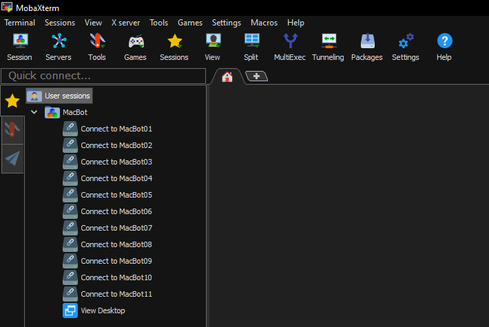

# Connect

## Install MobaXTerm


Home Edition, Windows Installer


Use 7Zip or Windows Zip Extractor to extract the compressed folder into the Downloads/ folder

<figure><figcaption></figcaption></figure>

Run the MobaXTerm MSI installer with the default configuration.

<figure><figcaption></figcaption></figure>

## Connection Profiles

<figure><figcaption></figcaption></figure>

Click **Fullscreen** and untoggle **Always on Top**.

<figure><figcaption></figcaption></figure>

You can now use **TAB + Windows** to toggle between your open tabs

<figure><figcaption></figcaption></figure>
