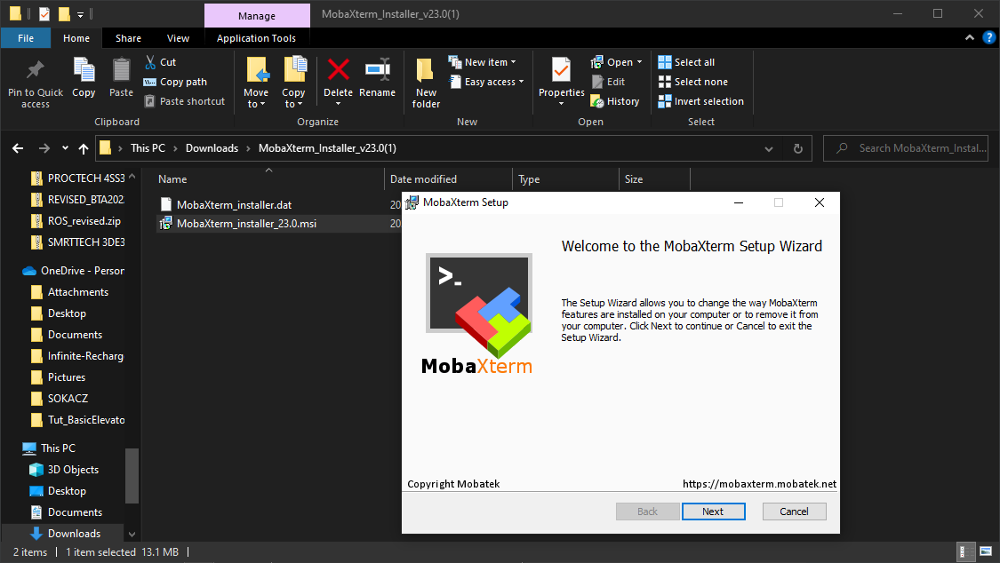

# Connect

## Install MobaXTerm


If on a lab PC, choose 'Portable', otherwise choose 'Installer'


## Connection Profiles

### Profile Links


SSH Bash Profile



VNC Profile


### Save each profile using the following steps:

* Click profile RAW link
* Click **Save Page As**

<figure><figcaption></figcaption></figure>

* Change file type to **All Files**

<figure><figcaption></figcaption></figure>

* Save to your Desktop/

<figure><figcaption></figcaption></figure>

## Lab Network

Use the following credentials to connect to the lab network on your personal PC:


[page-1.md](page-1.md)


## Connecting

Click the MacBot\_SSH profile . MobaXTerm will open.

<figure><figcaption></figcaption></figure>

Search for a **MacBot##** label on your MacBot unit

.png>)

Create an **SSH tunnel** to your MacBot unit over the **lab network.**



```bash
ssh -L 5902:localhost:5902 jnano@macbot01
```



```bash
ssh -L PC_Port:localhost:MacBot_Port user@pc_ip_or_name##
```





<figure><figcaption></figcaption></figure>

Start the VNC server by using **\~./autostart\_vnc.bash**

```bash
~/autostart_vnc.bash
```

<figure><figcaption></figcaption></figure>

Without closing the SSH tunnel tab, load the VNC profile

<figure><figcaption></figcaption></figure>

Enter the provided **MacBot password**:


[page-1.md](page-1.md)


A VNC session will be established

<figure><figcaption></figcaption></figure>

Click **Fullscreen** and untoggle **Always on Top**.

<figure><figcaption></figcaption></figure>

You can now use **TAB + Windows** to toggle between your open tabs

<figure><figcaption></figcaption></figure>
